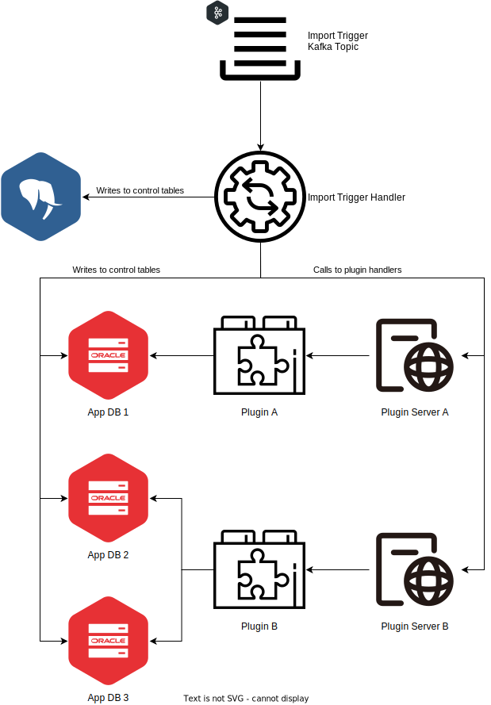

= VDI Module: Import Trigger Handler

ifdef::env-github[]
++++

  

++++
endif::[]
ifndef::env-github[]

endif::[]

This VDI module consumes import trigger messages from Kafka and performs dataset
import operations by writing to the internal cache DB, writing to target
application database control tables, and calling the appropriate plugin handler
for the dataset's type for each target project.