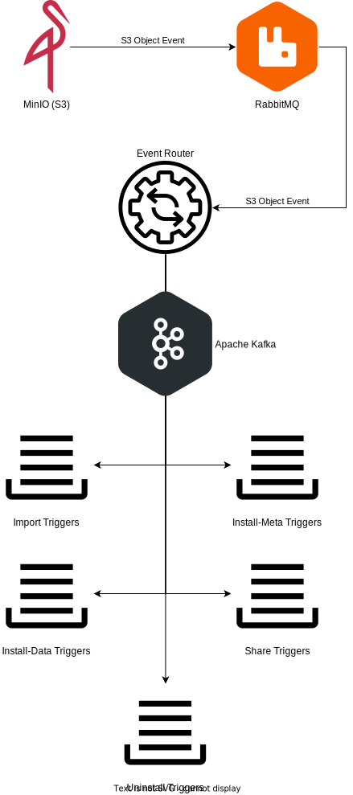

= VDI Module: Event Router
:toc: preamble

ifdef::env-github[]
++++

  

++++
endif::[]
ifndef::env-github[]

endif::[]

The Event Router VDI module is responsible for consuming events published by the
VEuPathDB global MinIO (S3) instance to the global RabbitMQ instance and routing
those events as triggers to various Kafka topics.

== Message Routing

Routing of MinIO object events follows a specific set of rules as defined here.

Note: routing of messages is not 1 to 1 input and output, a single input event
pulled from the RabbitMQ queue may result in multiple trigger messages being
published to Kafka.

=== Import Triggers

A MinIO event is considered and routed as an Import Trigger if the source object
that triggered the event has a path (object key) in S3 that aligns with the
rules for paths to either dataset upload objects or `meta.json` objects.

This means that when a raw user upload object is placed into the target S3
bucket or when a dataset's `meta.json` object is created or overwritten an
Import Trigger message will be routed to Kafka.

.Example Object Paths
--
----
{bucket-name}/vdi/{user-id}/{dataset-id}/upload/{file-name}
----
or
----
{bucket-name}/vdi/{user-id}/{dataset-id}/dataset/meta.json
----
--

=== Install-Meta Triggers

A MinIO event is considered and routed as an Install-Meta trigger if the source
object that triggered the event has a path (object key) in S3 that aligns with
the rules for `meta.json` object paths.

This means when a dataset's `meta.json` file is created or overwritten an
Install-Meta (or sometimes called Update-Meta) message will be routed to Kafka.

.Example Object Path
--
----
{bucket-name}/vdi/{user-id}/{dataset-id}/dataset/meta.json
----
--

=== Install-Data Triggers

A MinIO event is considered and routed as an Install-Data trigger if the source
object that triggered the event has a path (object key) in S3 that does not
align with any other routing rules as defined in this document.

.Expected Object Paths
--
----
{bucket-name}/vdi/{user-id}/{dataset-id}/dataset/data/{file-name}
----
or
----
{bucket-name}/vdi/{user-id}/{dataset-id}/dataset/manifest.json
----
--

=== Share Triggers

A MinIO event is considered and routed as a Share trigger if the source object
that triggered the event has a path (object key) in S3 that aligns with the
rules for share object paths/sub-paths.

There are expected paths for objects that should trigger this event, however any
object put under a dataset shares path will result in a Share trigger being
routed to Kafka.

.Expected Object Paths
--
----
{bucket-name}/vdi/{user-id}/{dataset-id}/dataset/shares/{recipient-id}/offer.json
----
or
----
{bucket-name}/vdi/{user-id}/{dataset-id}/dataset/shares/{recipient-id}/receipt.json
----
--

=== Uninstall Triggers

A MinIO event is considered and routed as an Uninstall trigger if the source
object that triggered the event has a path (object key) in S3 that aligns with
the rules for a soft-delete flag object path.

This means when a soft-delete object is created or overwritten an Uninstall
message will be routed to Kafka.

.Expected Object Path
--
----
{bucket-name}/vdi/{user-id}/{dataset-id}/dataset/delete-flag
----
--