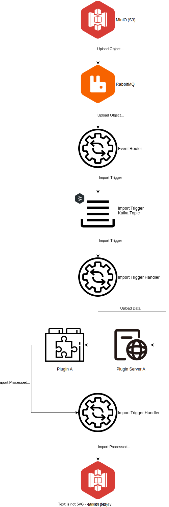

= VDI Module: Import Trigger Handler

This VDI module consumes import trigger messages from Kafka and performs dataset
import operations by writing to the internal cache DB, writing to target
application database control tables, and calling the appropriate plugin handler
for the dataset's type for each target project.

ifdef::env-github[]
++++

  

++++
endif::[]
ifndef::env-github[]

endif::[]

. An upload object is put into the MinIO (S3) bucket for VDI.
. MinIO emits an event through RabbitMQ for the created upload object.
. The event router module translates the event and routes a trigger to the
  relevant Kafka topic.
. The "Import" trigger handler picks up the trigger and...
.. Retrieves the upload data from MinIO
.. Posts the upload data to one of the relevant plugin handler servers
.. Pushes the import-processed data to MinIO
