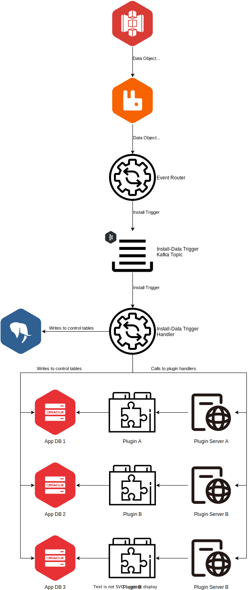

= VDI Module: Install-Data Trigger Handler

This VDI module consumes install-data trigger messages from Kafka and performs
dataset core data installation operations by calling the appropriate plugin
handlers for the target projects to perform the type specific installation of
the dataset into those projects' application databases.

ifdef::env-github[]
++++

  

++++
endif::[]
ifndef::env-github[]

endif::[]

. One or more dataset "data" objects are put into the MinIO (S3) bucket for VDI.
. MinIO emits events for the created data objects.
. The event router module translates the events and routes triggers to the
  relevant Kafka topic.
. The "Install-Data" trigger handler picks up the triggers and...
.. Using the `manifest.json` file determines whether all the data files yet
   exist in MinIO.
.. If all data files exist in MinIO...
... Updates the control tables in the internal Cache DB with the data timestamp
    for the newest data file.
... Posts the data files to the installation VDI plugin for the relevant
    projects (as defined in the dataset's metadata).
... Updates the control tables in each target project's application database
    with...
.... The timestamp of the newest data file
.... The installation result status and any warning or error messages