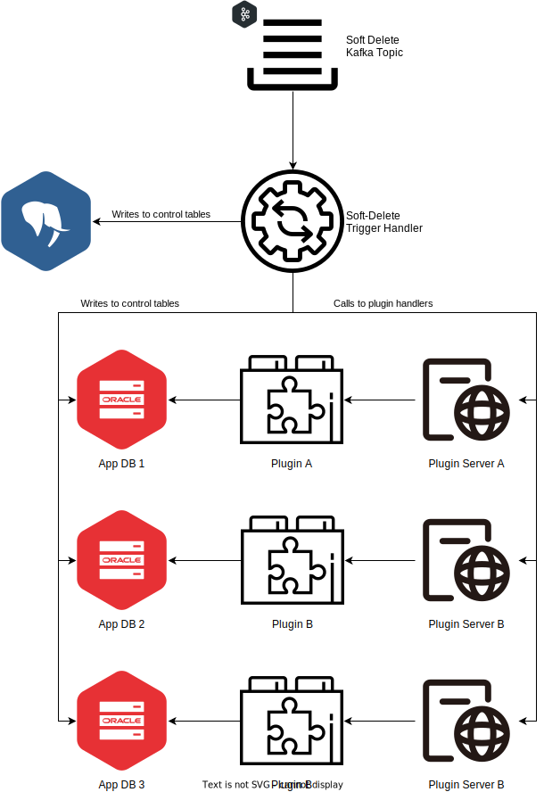

= VDI Module: Import Trigger Handler

ifdef::env-github[]
++++

  

++++
endif::[]
ifndef::env-github[]

endif::[]

This VDI module consumes soft-delete trigger messages from Kafka and performs
dataset uninstallation operations by updating the "deleted" flag in the internal
cache DB, updating the "deleted" flag in the target application database control
tables, and calling the appropriate plugin handler for the dataset's type for
each target project.