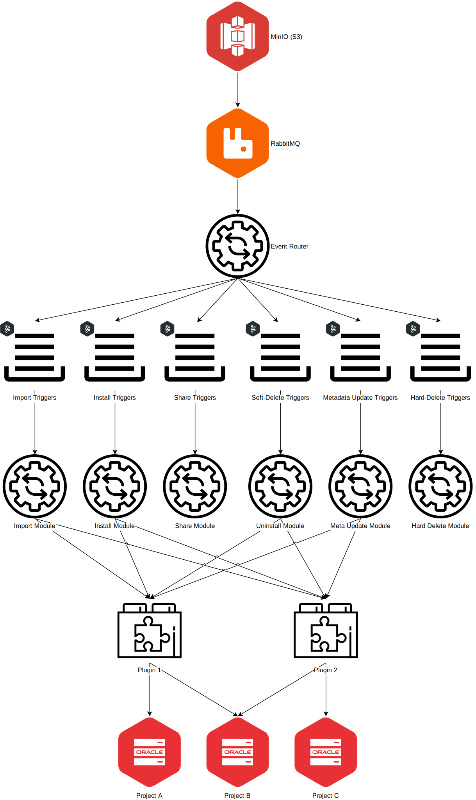

= VDI Design Overview
:toc:
:toclevels: 4
:source-highlighter: highlightjs
:github-url: https://github.com/VEuPathDB

ifdef::env-github[]
:tip-caption: :bulb:
:important-caption: :heavy_exclamation_mark:
endif::[]

The VEuPathDB Dataset Installer (VDI) is a system for installing datasets into
target VEuPathDB projects such as link:https://plasmodb.org/plasmo/app[PlasmoDB]
or link:https://microbiomedb.org/mbio/app[MicrobiomeDB].

VDI is an event driven system whose source is a MinIO (S3) object store which
publishes events for the creation of new dataset objects and deletions of those
dataset objects.  Those events are then routed through to the various VDI
<<Modules,modules>> to be processed and installed into one or more target
project databases.

== Actions

=== Dataset Lookup

Via the public HTTP API exposed by the <<rest-service,REST service>> users may
look up a listing of the datasets they have access to along with in-depth
details about specific target datasets.

The dataset listing will contain basic information about the datasets that are
either owned by or have been shared with the requesting user.  The result will
include the user-provided metadata attached to the dataset as well as import and
installation statuses for the dataset's target databases.

=== Dataset Metadata Update

Via the public HTTP API exposed by the <<rest-service,REST service>> users may
update the metadata they have attached to a target dataset.  Metadata includes
name for the dataset, as well as a brief summary and a long-form description.

Metadata changes may be propagated through the system to the target project
application databases if it is relevant for the dataset's type.

=== Dataset Sharing

Installed datasets may be shared by the dataset's owner with other target
VEuPathDB users by way of the VDI sharing mechanism.

A dataset share is based on a pair of objects that reside in the MinIO object
store, namely a share offer and a share receipt.  For a dataset to be made
visible to a target user, both an offer containing a "grant" action and a
receipt containing an "accept" action must exist.

Once a dataset share object pair have been created in MinIO, the object creation
events caused by the writing of those objects will be routed through the
<<event-router,event router>> to the <<share-handler,share trigger handler>>
which will perform the updates on the relevant project application databases to
enable the visibility of the target dataset to the appropriate user.

=== Dataset Deletion

Datasets may be marked as deleted by their owning user.  Deletions are "soft" in
that the data is not removed from the system immediately, and is instead marked
as deleted by creating a delete flag in MinIO (S3).  The creation of this flag
will trigger a series of actions by the VDI system to mark the dataset as
deleted in the relevant databases as well as the removal of dataset data from
the dataset's target application databases.

Soft deleted datasets are cleaned out of the system at a later date by a
periodic pruning process.

== Project Structure

=== Modules

Modules are self-contained services that operate under the VDI umbrella that
consume events from MinIO (S3) actions and perform specific actions on datasets
such as installing or uninstalling them from target databases.

Each module can be thought of as an independent service that just so happens to
coexist with the other modules in a single Docker container.

Dataset Reinstaller::
The dataset reinstaller module runs periodically or by manual trigger and
performs the steps necessary to uninstall and reinstall a broken dataset into
its target projects application databases.
+
This module is intended to perform cleanup of datasets that failed to install
due to a system bug or hiccup that has been checked and resolved by the
VEuPathDB developer team.  Such datasets are marked as ready-for-reinstall and
then are picked up by this module's next run to be processed.

[#event-router]
link:modules/event-router/readme.adoc[Event Router]::
The event router module is the first module that a MinIO event will be processed
by.  This module parses the event and routes it to the appropriate action
trigger queue (Apache Kafka topic) to be consumed by the appropriate dataset
processing module.

Hard-Delete Trigger Handler::
The hard-delete trigger handler consumes events stemming from the deletion of an
object from the MinIO object store.
+
At present this module is a hold-over from a previous design iteration that now
just logs hard deletion events.

link:modules/import-trigger-handler/readme.adoc[Import Trigger Handler]::
The import trigger handler consumes events stemming from the upload of a raw
dataset into MinIO.  This handler calls out to the relevant VDI plugin to
perform any necessary pre-processing of the dataset such as validation or
data transformation to ensure the dataset is in a state that is ready for
installation into the target database(s).

link:modules/install-data-trigger-handler/readme.adoc[Install Trigger Handler]::
The data installation handler consumes events stemming from the upload of
import-processed dataset data to MinIO.  This handler calls out to the relevant
VDI plugin to perform the installation of the dataset data into the target
application database(s).

Pruner::
The pruner module operates on a schedule and purges datasets that have been
soft-deleted for a configured amount of time from the VDI system.

Reconciler::
The reconciler module periodically checks that the state of the dataset object
store (MinIO) has been correctly propagated to the target project application
databases.
+
This means sifting through every object stored in MinIO and comparing the
timestamps of those object creations to the last seen timestamp as stored in the
VDI control tables in the internal cache database as well as each dataset's
target project application database.
+
When a dataset is found to be out of sync, a full synchronization of that
dataset is performed to correct the state in the VDI system.

[#rest-service]
link:modules/rest-service/readme.adoc[Rest Service]::
The rest-service module exposes the public API over the VDI system that enables
users to upload datasets to the VDI system as well as access details about their
upload datasets as well as update, delete, or share those datasets.

[#share-handler]
Share Trigger Handler::
The share trigger handler module consumes events stemming from the creation of a
"<<Dataset Sharing,share object>>" in MinIO.  This module enables or disables
access to target non-owning users of datasets to see those datasets in the VDI
API.

* link:modules/soft-delete-trigger-handler/readme.adoc[Soft-Delete Trigger Handler]
* Update Meta Trigger Handler

=== Components

App DB::
The app-db component exposes an API for performing actions on target project
application databases.

Cache DB::
The cache-db component exposes an API for performing actions on the VDI-internal
cache database.

Common::
The common component provides common functionality shared by most if not all
other components and modules.

Dataset Reinstaller::
The dataset-reinstaller component exposes an API for reinstalling datasets that
have been marked as "ready-for-reinstall".

Handler Client::
The handler-client component exposes an API for interacting with the VDI plugin
services over HTTP.

Install Cleanup::
The install-cleanup component exposes an API for marking datasets as
"ready-for-reinstall".

Kafka::
The Kafka component exposes an API for working with an Apache Kafka instance in
a manner that is tailored to the VDI processes.

LDAP::
The LDAP component exposes utilities for performing LDAP lookups for the Oracle
database connection configurations for the target project application databases.

Module Core::
The module core component provides an API definition and abstract base for
implementing VDI modules.

Plugin Mapping::

TODO

Pruner::
The pruner component exposes an API for pruning old soft-deleted datasets from
the VDI system.

Rabbit::

TODO

S3::

TODO

=== Database Schemata

==== Internal Cache Database

===== `vdi.datasets`

Core registry of datasets in the internal cache database.  All other VDI control
tables in the cache DB foreign key to this table.

[%header, cols="2m,2m,6m"]
|===
| Column | Type | Constraints

| dataset_id
| CHAR(32)
| PRIMARY KEY NOT NULL

| type_name
| VARCHAR
| NOT NULL

| type_version
| VARCHAR
| NOT NULL

| owner_id
| VARCHAR
| NOT NULL

| is_deleted
| BOOLEAN
| NOT NULL

| created
| TIMESTAMP WITH TIME ZONE
| NOT NULL
|===

===== `vdi.dataset_files`

Listing of dataset data files for each dataset in MinIO (S3).

[IMPORTANT]
--
TODO: This table should be dropped.
--

[%header, cols="2m,2m,6m"]
|===
| Column | Type | Constraints

| dataset_id
| CHAR(32)
| NOT NULL REFERENCES vdi.datasets (dataset_id)

| file_name
| VARCHAR
| NOT NULL
|===

.Additional Constraints
--
[%header, cols="4m,6"]
|===
| Name | Description

| dataset_files_file_to_dataset_uq
| Unique on `dataset_id` to `file_name` combinations.
|===
--

===== `vdi.dataset_projects`

[%header, cols="2m,2m,6m"]
|===
| Column | Type | Constraints

| dataset_id
| CHAR(32)
| NOT NULL REFERENCES vdi.datasets (dataset_id)

| project_id
| VARCHAR
| NOT NULL
|===

.Additional Constraints
--
[%header, cols="4m,6"]
|===
| Name | Description

| dataset_projects_uq
| Unique on `dataset_id` to `project_id` combinations.
|===
--

===== `vdi.dataset_metadata`

[%header, cols="2m,2m,6m"]
|===
| Column | Type | Constraints

| dataset_id
| CHAR(32)
| NOT NULL UNIQUE REFERENCES vdi.datasets (dataset_id)

| name
| VARCHAR
| NOT NULL

| summary
| VARCHAR
|

| description
| VARCHAR
|
|===

===== `vdi.sync_control`

[%header, cols="2m,2m,6m"]
|===
| Column | Type | Constraints

| dataset_id
| CHAR(32)
| NOT NULL UNIQUE REFERENCES vdi.datasets (dataset_id)

| shares_update_time
| TIMESTAMP WITH TIME ZONE
| NOT NULL

| data_update_time
| TIMESTAMP WITH TIME ZONE
| NOT NULL

| meta_update_time
| TIMESTAMP WITH TIME ZONE
| NOT NULL
|===

===== `vdi.dataset_share_offers`

[%header, cols="2m,2m,6m"]
|===
| Column | Type | Constraints

| dataset_id
| CHAR(32)
| NOT NULL REFERENCES vdi.datasets (dataset_id)

| recipient_id
| VARCHAR
| NOT NULL

| status
| VARCHAR
| NOT NULL
|===

Where `status` will be one of:

* `grant`
* `revoke`

.Additional Constraints
--
[%header, cols="4m,6"]
|===
| Name | Description

| owner_share_uq
| Unique on `dataset_id` to `recipient_id` combinations.
|===
--

===== `vdi.dataset_share_receipts`

[%header, cols="2m,2m,6m"]
|===
| Column | Type | Constraints

| dataset_id
| CHAR(32)
| NOT NULL REFERENCES vdi.datasets (dataset_id)

| recipient_id
| VARCHAR
| NOT NULL

| status
| VARCHAR
| NOT NULL
|===

Where `status` will be one of:

* `accept`
* `reject`

.Additional Constraints
--
[%header, cols="4m,6"]
|===
| Name | Description

| owner_share_uq
| Unique on `dataset_id` to `recipient_id` combinations.
|===
--

===== `vdi.import_control`

[%header, cols="2m,2m,6m"]
|===
| Column | Type | Constraints

| dataset_id
| CHAR(32)
| NOT NULL UNIQUE REFERENCES vdi.datasets (dataset_id)

| status
| VARCHAR
| NOT NULL

|===

Where `status` is one of:

* `queued`
* `in-progress`
* `complete`
* `invalid`

===== `vdi.import_messages`

[%header, cols="2m,2m,6m"]
|===
| Column | Type | Constraints

| dataset_id
| CHAR(32)
| NOT NULL UNIQUE REFERENCES vdi.datasets (dataset_id)

| message
| VARCHAR
| NOT NULL
|===

==== Application Databases

===== `vdi.dataset`

Core registry of all VDI datasets that have had some form of installation
attempt made on the containing application database.

[%header, cols="2m,2m,6m"]
|===
| Column | Type | Constraints

| dataset_id
| CHAR(32)
| PRIMARY KEY NOT NULL

| owner
| NUMBER
| NOT NULL

| type_name
| VARCHAR2(64)
| NOT NULL

| type_version
| VARCHAR2(64)
| NOT NULL

| is_deleted
| NUMBER
| NOT NULL
|===

===== `vdi.dataset_install_message`

Installation status/messages table for dataset installation attempts on the
containing application database.

Each record will correspond to an attempt to install either metadata or dataset
data for a target dataset and will contain a mandatory install status as well
as optional messages emitted by the installer plugin during the installation.

[%header, cols="2m,2m,6m"]
|===
| Column | Type | Constraints

| dataset_id
| CHAR(32)
| NOT NULL REFERENCES vdi.dataset (dataset_id)

| install_type
| VARCHAR2(64)
| NOT NULL

| status
| VARCHAR(64)
| NOT NULL

| message
| CLOB
|
|===

The `install_type` and `status` columns are enums controlled by the VDI service
which originally contained the following values:

`install_type`::
* `meta`
* `data`

`status`::
* `running`
* `complete`
* `failed-validation`
* `failed-installation`
* `missing dependency`
* `ready-for-reinstall`

===== `vdi.dataset_project`

Link table mapping target datasets to one or more projects that share the same
application database.

Most often this table will contain only one entry per dataset as most
application databases are not shared between projects.

[%header, cols="2m,2m,6m"]
|===
| Column | Type | Constraints

| dataset_id
| CHAR(32)
| NOT NULL REFERENCES vdi.dataset (dataset_id)

| project_id
| VARCHAR2(64)
| NOT NULL
|===

===== `vdi.dataset_visibility`

Controls visibility of target datasets to users to whom those datasets hava been
shared.  Each record in this table declares that a dataset is visible to a user.

[%header, cols="2m,2m,6m"]
|===
| Column | Type | Constraints

| dataset_id
| CHAR(32)
| NOT NULL REFERENCES vdi.dataset (dataset_id)

| user_id
| NUMBER
| NOT NULL
|===

===== `vdi.sync_control`

Contains timestamps of various elements of a dataset as they are recorded in S3.

These timestamps are used to determine when a dataset is out of sync with S3 and
needs to be resynchronized.

[%header, cols="2m,2m,6m"]
|===
| Column | Type | Constraints

| dataset_id
| CHAR(32)
| NOT NULL REFERENCES vdi.dataset (dataset_id)

| shares_update_time
| TIMESTAMP WITH TIME ZONE
| NOT NULL

| data_update_time
| TIMESTAMP WITH TIME ZONE
| NOT NULL

| meta_update_time
| TIMESTAMP WITH TIME ZONE
| NOT NULL

|===

== Plugins

VDI plugins are collections of scripts or binaries that are packaged in a Docker
image behind an {github-url}/vdi-plugin-handler-server[HTTP service] that calls
the relevant scripts as needed.

For a detailed listing of the plugin scripts and their inputs and outputs, see
the {github-url}/vdi-plugin-handler-server#plugin-scripts[Plugin Server Readme]
which includes information about each of the plugin scripts.

== S3

=== Structure

[source]
----
vdi/{UserID}/{DatasetID}/dataset/delete-flag
vdi/{UserID}/{DatasetID}/dataset/manifest.json
vdi/{UserID}/{DatasetID}/dataset/meta.json

vdi/{UserID}/{DatasetID}/dataset/data/{DataFile}

vdi/{UserID}/{DatasetID}/dataset/shares/{RecipientID}/offer.json
vdi/{UserID}/{DatasetID}/dataset/shares/{RecipientID}/receipt.json

vdi/{UserID}/{DatasetID}/upload/{UploadFile}
----

=== `manifest.json`

The dataset manifest contains an index of all the raw input files as well as
import-processed data files.  In VDI 1.0, this file will be immutable, however
there may be a possible future requirement for updates to the manifest an
underlying data files.

[source, json]
----
{
  "inputFiles": [
    "raw-file-1.json",
    "raw-file-2.csv"
  ],
  "dataFiles": [
    "data-file-1.csv",
    "data-file-2.csv"
  ]
}
----

=== `meta.json`

The `meta.json` file contains user metadata associated with the dataset.  It
corresponds exactly to the data provided to the <<rest-service,HTTP API>> in the
initial `POST` request used to create the dataset.  This file contains both
mutable (by the owning user) and immutable information.

* Mutable
** name
** summary
** description
* Immutable
** type
** projects
** owner
** dependencies

[source, json]
----
{
  "type": {
    "name": "ISA",
    "version": "1.0"
  },
  "projects": ["ClinEpiDB"],
  "owner": "12345",
  "name": "My Awesome Study",
  "summary": "This is my awesome study",
  "description": "I used my awesome methodology",
  "dependencies": [
    {
      "resourceIdentifier": <value>,
      "resourceVersion": <value>,
      "resourceDisplayName": <value>
    }
  ]
}
----

=== `shares/\{RecipientID}/`

Separate files are used to track the owner side and recipient side of a sharing
"contract".  This allows us to avoid race conditions between these two
independent pieces of state.  Once a share file is introduced, it is stored in
S3 along with the dataset data for the lifetime of that dataset.

==== `offer.json`

[source, json]
----
{
  "action": "grant | revoke"
}
----

==== `receipt.json`

[source, json]
----
{
  "action": "accept | reject"
}
----

== User Quotas

To reach feature parity with the original user dataset upload system, the new
VDI system will implement and enforce user upload quotas, capping users' dataset
uploads to a configurable limit (the old user dataset system limit was 10GiB).

User quotas are not configurable on a per-user basis, and instead follow a
global limit set as a configuration parameter on the VDI service.

Quota usage is calculated by summing the sizes of the user's upload files only,
limited to datasets that have not been soft-deleted.

User uploads will be capped initially at 1GiB per upload, or the user's
remaining quota space if that value is lesser.
