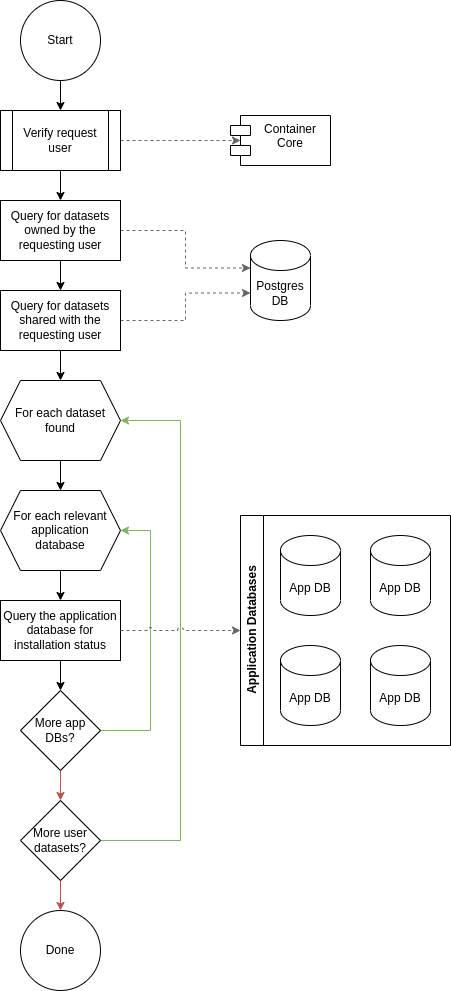
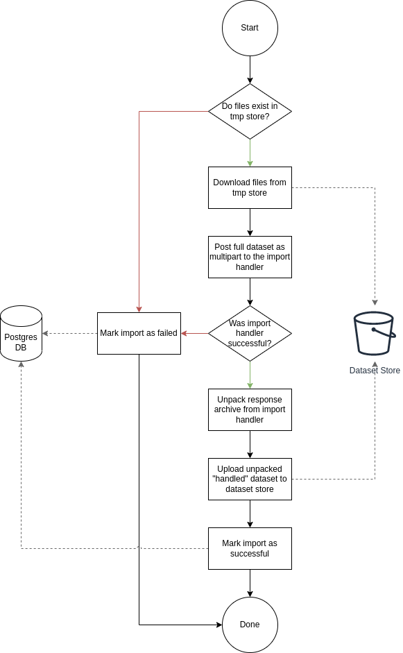
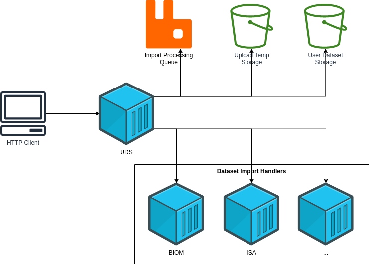

= User Dataset System
:source-highlighter: highlightjs
:icons: font
:toc: preamble

ifdef::env-github[]
:tip-caption: :bulb:
:important-caption: :heavy_exclamation_mark:
endif::[]

Dataset Store = Minio

== User Dataset Service

=== Actions

[%header, cols="3,1,6"]
|===
| Action | Source | Description

| <<List User Datasets>>
| HTTP
| List all user datasets owned by or shared with a user.

| <<Get User Dataset Info>>
| HTTP
| Get details about a user dataset including who it has been shared with.

| <<Upload User Dataset>>
| HTTP
| Upload a new user dataset to be imported.

| <<Update User Dataset Metadata>>
| HTTP
| Update the user metadata for a user dataset.

| <<Offer User Dataset Share>>
| HTTP
| Offer to share a user dataset.

| Revoke UD Share
| HTTP
| Revoke an outgoing share offer for a user dataset.

| <<Accept User Dataset Share>>
| HTTP
| Accept an incoming share offer for a user dataset.

| Reject UD Share Offer
| HTTP
| Reject an incoming share offer for a user dataset.

| <<Delete User Dataset>>
| HTTP
| Remove a user dataset.

| <<Process Import>>
| RabbitMQ <1>
| Submit an uploaded user dataset to the appropriate import handler for
  validation and processing.

| <<Process User Dataset Store Change>>
| RabbitMQ <2>
| Process a change in the User Dataset Store that has been published to
  RabbitMQ.

| Reconciliation
| ???
| ???

| Project Sync
| RabbitMQ <3>
| ???

| Hard Delete Datasets
| ???
| Hard delete datasets from the Dataset Store that have been soft deleted for
  longer than a specified duration.
|===

==== List User Datasets

.Response types?
[source, typescript]
----
interface Response {
  offset: number
  resultCount: number
  results: Array<Result>
}

interface Result {
  userDatasetID: string
  ownerID: number
  projectIDs: Array<String>
  status: StatusInfo
}

interface StatusInfo {
  import: "awaiting-import" | "importing" | "imported" | "failed"
  install?: Array<InstallStatusInfo>
}

interface InstallStatusInfo {
  projectID: string
  status: "running" | "complete" | "failed" | "ready-for-reinstall"
}
----

.Response Example
[source, json]
----
{
  "offset": 0,
  "resultCount": 2,
  "results": [
    {
      "userDatasetID": "df8fede7ff71608e24a5576326e41c75",
      "ownerID": 123456,
      "projectIDs": [
        "PlasmoDB",
        "ToxoDB"
      ],
      "status": {
        "import": "importing"
      }
    },
    {
      "userDatasetID": "7fa3b767c460b54a2be4d49030b349c7",
      "ownerID": 123456,
      "projectIDs": [
        "FungiDB"
      ],
      "status": {
        "import": "imported",
        "install": [
          {
            "projectID": "FungiDB",
            "status": "ready-for-reinstall"
          }
        ]
      }
    }
  ]
}
----

==== Get User Dataset Info

. Client makes a `GET` request for the target user dataset.
. Service queries postgres database for information about the target dataset?
. Service queries application databases for installation status of dataset.
. Service returns information about the target dataset which will include:
.. user dataset id
.. offered shares?
.. status(es)?

==== Upload User Dataset

image:assets/upload-ud.png[]

.Response Type
[source, typescript]
----
interface Response {
  userDatasetID: string
}
----

.Response Example
[source, json]
----
{
  "userDatasetID": "89e837da8dc2b299b592f4ad82c4667a"
}
----

==== Update User Dataset Metadata

. Client makes a `PATCH` request to the user dataset containing the fields that
  should be updated.
. Service verifies the existence of the target user dataset
.. How?
. Service verifies ownership of the target user dataset
.. How?
. Service performs sanity checking on the metadata being changed.
.. Ensure only mutable fields are being changed
.. Ensure the data going into those mutable fields is the correct type
. Service writes the updated metadata to the User Dataset Store
. Service returns 204

.Request Type
[source, typescript]
----
interface Request {
  userDatasetID: string
  name?: string
  summary?: string
  description?: string
}
----

.Request Example
[source, json]
----
{
  "userDatasetID": "89e837da8dc2b299b592f4ad82c4667a",
  "description": "My new description text."
}
----

==== Offer User Dataset Share

. Client makes a `PUT` request to the above URL with a body containing an action
  of "grant" or "revoke".
. Service sanity checks PUT request body
. Service verifies the existence of the target user dataset
. Service verifies that the target user dataset is owned by the requesting user
. Service writes a share offer file containing the requested action to the User
  Dataset Store

==== Accept User Dataset Share

. Client makes a PUT request to the above URL with a body containing an action
  of "accept" or "reject"
. Service sanity checks PUT request body.
. Service verifies the existence of the target user dataset
. Service verifies that the target user dataset has a share offer available with
  an offer action of "grant"
. Service writes a share receipt file containing the requested action to the
  User Dataset Store

==== Delete User Dataset

. Client makes a `DELETE` request to the above service path.
. Service verifies the target user dataset exists
. Service verifies the requesting user owns the target user dataset
. Service creates a `deleted` flag file for the user dataset in the User Dataset
  Store

==== Process Import

==== Process User Dataset Store Change

. Determine the nature of the change ???
.. What are the possible changes that could happen?
... marked as deleted
... actually deleted?
... share granted
... share accepted
... share rejected
... share revoked
... initial upload
... meta changed
.. Compare the last modified timestamps in S3 to the timestamps in the postgres
   `sync_control` table.
. ???
. Update postgres?
. Queue changes to relevant application databases?

== Import Handler Service

=== Actions

[%headers, cols="2,1,7"]
|===
| Action | Source | Description

| <<Process Import>>
| HTTP
| Performs import validation/transformations on an uploaded dataset to prepare
  it for import and eventual installation into one or more VEuPathDB sites.
|===

==== Process Import

Performs import validation/transformations on an uploaded dataset to prepare it
for import and eventual installation into one or more VEuPathDB sites.

[IMPORTANT]
--
|===
h| What is the contract for data being placed in the inputs directory? +
   Should the meta file always have the same name? +
   How are files differentiated?

| The `meta.json` file and `dataset.json` files are generated by the service and
  will not be provided to the handler script, thus the handler script does not
  need to know about them and no special contract is needed. +
 +
  This means the contract is simply that some files will be put in the inputs
  directory and the script can figure out what they are and what they mean.
|===
--

. Create workspace directory for the import being processed
.. Create "input" subdirectory
.. Create "output" subdirectory
. Push the files uploaded for the dataset to the "input" subdirectory of the
  import workspace
. Call the import script, passing in the paths to the input and output
  directories
. Generate a `dataset.json` file
. Generate a `meta.json` file
. Bundle the files placed in the output directory
. Return the bundled archive to the HTTP caller

== General Q & A

|===
h| What if the communication between the service and the import plugin was
   handled via a RabbitMQ queue?

| This adds a lot of complexity to the design.  If we had a stream management
  platform such as Apache Spark or Kafka, this would be more feasible, but
  without such a platform it would be difficult to test and maintain.
|===

|===
h| Why not write the whole thing as a stream system in Spark or Kafka?
|
|===

|===
h| How do we hide endpoints from the public API?
|
|===

|===
h| How are the statuses displayed to the client/user? We have multiple status
   types; it could be confusing.

| The statuses will be returned in a "status object" as described in the misc
  notes below.
|===

|===
h| Installers: What are the inputs and outputs?

a| Installers will have their data posted to them the same as with the import
handler.  A bulk HTTP request containing the dataset files and metadata will be
submitted to the Installer Service and the installer will take it from there.
|===

|===
h| Why is it a 2 request process to create a user dataset upload? +
Originally, the 2-step process was because we needed to guarantee ordering of
receipt of the metadata followed by dataset files, but since the data is going
to a cache/queue before being processed, does this matter anymore?

| We can ditch the 2-step process.  Now that we have
link:https://github.com/VEuPathDB/lib-jersey-multipart-jackson-pojo[lib-jersey-multipart-jackson-pojo]
we don't need to separate the meta upload from the file uploads as all the
uploaded data will be preloaded into files for us automatically.
|===

|===
h| What does the dataset delete flow look like?
a| . Deletion flag is created
   . ???
|===

|===
h| How do installers surface warnings?
|
|===

|===
h| How do failed installations get reported to users?
|
|===

|===
h| How does undeleting work?
|
|===

== General Implementation Notes / Thoughts

* Service will have to check the soft delete flag before permitting any actions
  on a user dataset.

* The service wrapping the installer and import handler should be written in
  a JVM language to make use of the existing tooling for handling multipart that
  we have established.

== Unorganized Notes

=== Submitting a User Dataset

. Client sends "prep" request with metadata about the dataset to be
  uploaded.
.. Service sanity checks the posted metadata to ensure that it at least _could
   be_ valid.
.. Service puts the metadata into an in-memory cache with a short, configurable
   expiration
.. Service generates a user dataset ID
.. Service returns a user dataset ID
. Client sends an upload request with the file or files comprising the user
  dataset.
.. Service pulls the metadata for the user dataset out of the in-memory cache.
.. Service submits the metadata and the uploaded files to an internal job queue.
.. Service returns a status indicating whether the import process has been
   started

=== [Internal] Processing an Import

When a worker thread becomes available to process an import, it will be pulled
from the queue and the following will be executed.

. Worker submits the metadata for the job to be processed to the import handler
  plugin.
.. Import handler does whatever it needs to do to prepare for processing a user
   dataset.
. Worker submits the files for the dataset to the import handler.
.. Import handler processes user dataset and produces a gzip bundle of the
   dataset state to be uploaded to the Dataset Store
. Worker unpacks dataset bundle
. Worker uploads dataset files to the Dataset Store
. Worker updates the status of the dataset to "imported" or similar

// TODO: make a flowchart of a single "event" going through the process

// Multiple import queues?  Import queue per importer? (maybe phase 2)

== Misc Notes

Notes and thoughts to be folded into the design doc above once resolved.

=== Statuses

What different statuses are there?::
* Upload status
* `userdataset` table status (appears to also be upload status?)
* Install status (per project) (this field will be omitted or empty until the
  import is completed successfully)
+
.Status representation idea?
[source, json]
----
{
  "statuses": {
    "import": "complete",
    "install": [
      {
        "projectID": "PlasmoDB",
        "status": "complete"
      }
    ]
  }
}
----

=== Misc Diagrams

.User Dataset Import Components

// ////////////////////////////////////////////////////////////////////////// //
== Database Schemata

// ////////////////////////////////////////////////////////////////////////// //
=== Internal PostgreSQL Database

Tables here cannot be the single source of truth for information about the
datasets.  While this database should not be wiped, it needs to be constructable
from the state of the Dataset Store.

// ////////////////////////////////////////////////////////////////////////// //
==== `sync_control`

This table indicates the last modified timestamp for the various components that
comprise a user dataset.

[%header, cols="2m,1m,7"]
|===
| Column | Type | Comment

| dataset_id
| CHAR(32)
|

| shares_update_time
| TIMESTAMPTZ
| Timestamp of the most recent last_modified date from the user dataset share
  files.

| data_update_time
| TIMESTAMPTZ
| Timestamp of the most recent last_modified date from the user dataset data
  files.

| meta_update_time
| TIMESTAMPTZ
| Timestamp of the meta.json last_modified date for the user dataset.
|===

// ////////////////////////////////////////////////////////////////////////// //
==== `owner_share`

[%header, cols="2m,1m,7"]
|===
| Column | Type | Comment

| dataset_id
| CHAR(32)
|

| shared_with
| BIGINT
| User ID of the user the dataset was shared with

| status
| enum
| Current status of the share +
One of "granted" \| "revoked"
|===

// ////////////////////////////////////////////////////////////////////////// //
==== `recipient_share`

[%header, cols="2m,1m,7"]
|===
| Column | Type | Comment

| dataset_id
| CHAR(32)
|

| shared_with
| BIGINT
| User ID of the user the dataset was shared with

| status
| enum
| Current status of the share receipt. +
One of "accepted" \| "rejected"
|===

// ////////////////////////////////////////////////////////////////////////// //
==== `user_dataset_control`

[%header, cols="2m,1m,7"]
|===
| Column | Type | Comment

| dataset_id
| CHAR(32)
|

| upload_status
| enum
| "awaiting-import", "importing", "imported", "failed"
|===

// ////////////////////////////////////////////////////////////////////////// //
==== `user_datasets`

[%header, cols="2m,1m,7"]
|===
| Column | Type | Comment

| dataset_id
| CHAR(32)
|

| type_name
| VARCHAR
|

| type_version
| VARCHAR
|

| user_id
| BIGINT
|

| is_deleted
| BOOLEAN
|

| status
|
| ???

|===

// ////////////////////////////////////////////////////////////////////////// //
==== `user_dataset_files`

[%header, cols="2m,1m,7"]
|===
| Column | Type | Comment

| dataset_id
| CHAR(32)
|

| file_name
| VARCHAR
|
|===

// ////////////////////////////////////////////////////////////////////////// //
==== `user_dataset_projects`

[%header, cols="2m,1m,7"]
|===
| Column | Type | Comment

| dataset_id
| CHAR(32)
|

| project_id
| VARCHAR
|
|===

// ////////////////////////////////////////////////////////////////////////// //
==== `user_dataset_metadata`

[%header, cols="2m,1m,7"]
|===
| Column | Type | Comment

| dataset_id
| CHAR(32)
|

| name
| VARCHAR
|

| summary
| VARCHAR
|

| description
| VARCHAR
|
|===

// ////////////////////////////////////////////////////////////////////////// //
=== Application Database

[IMPORTANT]
====
|===
h| What schema will these tables live in?
| ???
|===
====

// ////////////////////////////////////////////////////////////////////////// //
==== `user_datasets`

[IMPORTANT]
====
|===
h| What date gets stored in the `creation_time` column?
| ???
|===
====

[%header, cols="2m,1m,7"]
|===
| Column | Type | Comment

| dataset_id
| CHAR(32)
|

| owner
| BIGINT
| Owner user ID

| type
| VARCHAR
| Dataset type string.

| version
| VARCHAR
| Dataset type version string.

| creation_time
| TIMESTAMP
| ???

| is_deleted
| TINYINT(1)
| Soft delete flag.
|===

// ////////////////////////////////////////////////////////////////////////// //
==== `user_dataset_install_messages`

[IMPORTANT]
====
|===
h| What is a message_id?
| ???
h| What is an install type?
| ???
|===
====

[%header, cols="2m,1m,7"]
|===
| Column | Type | Comment

| dataset_id
| CHAR(32)
| Foreign key to `user_datasets.dataset_id`

| message_id
|
| ???

| install_type
|
| ???

| status
| enum
| "running", "complete", "failed", "ready-for-reinstall"

| message
| VARCHAR
| failure message?
|===

// ////////////////////////////////////////////////////////////////////////// //
==== `user_dataset_visibility`

[%header, cols="2m,1m,7"]
|===
| Column | Type | Comment

| dataset_id
| CHAR(32)
| Foreign key to `user_datasets.dataset_id`

| user_id
| BIGINT
| ID of the share recipient user who should be able to see the user dataset.
|===

// ////////////////////////////////////////////////////////////////////////// //
==== `user_dataset_projects`

[IMPORTANT]
====
|===
h| What is the purpose of this table being in the application database?  Does an
   application care about what _other_ sites a dataset is installed in?  Should
   the VDI service be the only point of truth for this?
| ???
|===
====

[%header, cols="2m,1m,7"]
|===
| Column | Type | Comment

| dataset_id
| CHAR(32)
| Foreign key to `user_datasets.dataset_id`

| project_id
| VARCHAR
| Name/ID of the target site for the user dataset.
|===