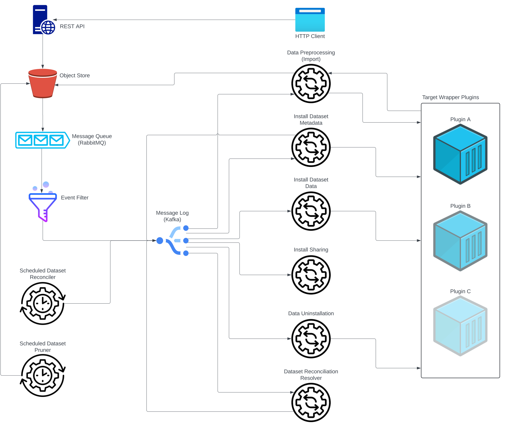

= VDI: VEuPathDB Dataset Installer
:toc: left
:toclevels: 3
:icons: font
:source-highlighter: highlightjs
:gh-icon: image:overview-img/github.svg[width=18]

The VEuPathDB Dataset Installer system (VDI) is an asynchronous, event driven,
pluggable, data ingestion platform built to transform and publish data from an
S3 compatible object store into any number of target systems.

.System Overview

'''

The core of VDI's design is the object store.  For VDI, this object store is the
absolute point of truth from which all system state is derived. From this origin
point, VDI can start from a blank slate and rebuild a state identical to any
other VDI instance attached to that object store or a replica.

VDI's goal as a platform is to be able to take data of any number of varying
types from the source object store and publish that data to any number of
relevant target systems.  To accomplish that goal, VDI uses external
<<plugins, plugin services>> to perform data-type specific operations such as
validation and installation.

== Operation as a Service

The core driver of VDI's normal operation is the stream of object events emitted
by an S3-like object store (MinIO in practice). When data is put into or removed
from a target bucket by any means, including replication, VDI will react to that
event by performing any steps necessary to reflect that change in its own state
or in the state of any relevant data install targets.

While in operation, multiple VDI deployments attached to replications of the
same data will each, independently perform the same work roughly in parallel
depending on the speed of the data replication.

Events coming from the object store are filtered and categorized into operation
types a.k.a. <<lanes,'lanes'>> by the <<event-router>>.  The events from each
lane are then translated into JSON messages containing only the required details
and emitted to lane-specific Kafka topics.

In addition to the event handling lanes, VDI also contains several additional
services and <<daemons,background processes>> that are in constant operation.

[#lanes]
== Lanes

Individual lanes of event processing are their own self-contained sub-services
within the VDI instance, each of which subscribing to a single Kafka topic and
executing work for messages received.

Upon receiving a message, each lane is responsible for validating the state of
the source dataset in the object store and in any relevant installation target
systems before deciding whether to forward the data to the
<<plugins, plugin service>> configured to handle data of that specific
<<dataset-types, dataset's type>>.

.Event Processing Lanes
. <<import-lane,Data Preprocessing>>
. <<update-meta-lane,Metadata Installation>>
. <<install-data-lane,Dataset Data Installation>>
. <<sharing-lane,Dataset Sharing and Unsharing>>
. <<uninstall-lane,Dataset Uninstallation (Soft-Delete)>>
. <<hard-delete-lane,Dataset Hard-Delete>>
. <<reconciler-lane,Dataset Reconciliation>>

[CAUTION]
--
Event ordering stated or implied in the lane descriptions below is to make the
overall process flow easier to understand initially.  In reality, events may be
received in any order, how or when they are acted on is discussed in the
<<event-ordering>> section.
--

[#import-lane]
=== Import: Data Preprocessing

// TODO: flow chart showing import-ready zip going to plugin and install-ready
//       zip returning to minio

After raw data is uploaded into the object store, the 'first' step (called the
"import" step) is to perform data validation and optionally reformatting.

The import lane first checks the object store to determine if the dataset is
still in an importable state (has not been marked as deleted, has not already
been imported) before passing the dataset's data and metadata to the
<<plugins, plugin>> registered with VDI to handle that
<<dataset-types, dataset's type>>.

Unlike the other plugin operations (install-meta, install-data, uninstall),
the import operation is not dependent on, nor does it have any interaction with
an installation target.  This operation is meant to perform syntactic validation
and any minor formatting adjustments that are needed to prepare data for
installation.  In practice this generally means transforming structured data
into tabular data where necessary.

[#update-meta-lane]
=== Update Meta: Metadata Installation and Updates

The 'next' step in data making it from raw upload to being published into a
target system is installing metadata about the dataset into that target system,
informing the system of the dataset's existence.

The metadata installation and update lane (named 'update-meta') is responsible
for pushing and updating metadata about a dataset in the target systems relevant
to that dataset.

At a minimum, the update-meta lane installs the following subset of the full
<<dataset-meta,dataset metadata>> defined on initial dataset upload.

. Dataset submitter user ID
. Dataset ID
. <<dataset-types,Dataset Type>>
. Dataset name
. Dataset description

This subset makes up the base for a dataset's
<<control-records,control records>> in a target system.  Additionally,
<<plugins,plugins>> provide an optional additional mechanism through which some
dataset types may perform custom installation steps of metadata about a dataset.

As the name 'update-meta' implies, dataset metadata may be updated by submitting
users.  When

A dataset's actual data cannot be installed into a target system without the
meta or 'control' records first being present.

[NOTE]
--
As a special case, because the meta/control records are required to be present
in a target system for an install to happen, on successful completion, the
update-meta lane fires a dataset reconciliation event to try and avoid the
possibility of a long wait for a dataset to be installed if the install event
hits before the update-meta event.  See <<event-ordering>> for more information.
--

[#install-data-lane]
=== Install Data: Dataset Content Installation

Once a dataset has been preprocessed and its metadata has been installed into a
target system, VDI may now attempt to install the dataset data itself into the
relevant target systems.

The

// TODO: the plugin has install meta in it
// TODO: the plugin has check compatibility in it

[#sharing-lane]
=== Sharing

[#uninstall-lane]
=== Soft-Delete: Uninstallation

The soft-delete lane performs the uninstallation of dataset data from relevant
target systems.  Control records are left in the target systems indicating that
the dataset did exist but has been marked as deleted until the <<dataset-pruner,
Dataset Pruner>> eventually purges the data from the system entirely.

Soft deletes were baked in to assist in debugging, and to enable the future
addition of a feature allowing users to undelete datasets that were deleted
within a configurable time window.

[#hard-delete-lane]
=== Hard-Delete

The hard-delete lane in its current form is a remnant of a previous design
iteration that was left in place simply to log the removal of objects from the
object store.

In future updates this lane is planned to handle the final delete logic that
currently lives in the <<reconciliation-scheduler,Reconciler>> and
<<dataset-pruner,Dataset Pruner>>.

[#reconciler-lane]
=== Dataset Reconciliation

The dataset reconciliation lane is responsible for examining the state of a
dataset in the object store and ensuring that state is accurately reflected in
the internals of VDI as well as in all relevant installation targets. The
dataset reconciliation lane attempts corrections or updates to target system
state by firing events for the other lanes to pick up and process.

For example, if the dataset reconciler receives a reconciliation event for a
dataset that is marked as deleted in the object store, but is not yet
uninstalled from an installation target, the dataset reconciler will fire an
uninstallation event for the dataset for the
<<uninstall-lane,uninstallation lane>> to process.

[#events]
== Events

VDI-internal events are 3-field JSON messages containing only the identifiers
for the relevant dataset and an event source indicator which informs whether the
event originated from an object store bucket event, or if a reconciliation
process fired the event.

{gh-icon} https://github.com/VEuPathDB/vdi-service/blob/main/lib/kafka/src/main/kotlin/vdi/component/kafka/EventMessage.kt[Event Type Definition]

[%collapsible]
.Example Event
====
[source, json]
----
{
  "userID": 123456,
  "datasetID": "VNY9UUYo8ZA",
  "source": "ObjectStore"
}
----
====

These events do not contain any additional information as the state of the
dataset or object store may have changed by the time the event is processed.
When an event is eventually processed by the relevant lane, that lane is
responsible for validating the status of the dataset before operating on that
dataset.

=== Event Types

Events themselves are not actually 'typed', the type is determined by which
Kafka topic the event message is submitted to.

{gh-icon} https://github.com/VEuPathDB/vdi-service/blob/main/lib/env/src/main/kotlin/vdi/component/env/EnvKey.kt#L457-L500[Event Topic Definitions]

==== Import

When a dataset is initially uploaded, events are submitted to the import topic
when an <<import-ready,import ready>> file or a
<<metadata-json,dataset meta file>> are put into the object store.  This means
that for every upload, 2 import events will be fired.

The <<reconciler-lane,dataset reconciliation lane>> may also fire import events
if it finds that import-ready files are present in the object store, but install
ready files are not.

==== Install

An install event is fired when a <<install-ready,install-ready files>> are put
into the object store.

Install events may also be fired by the <<reconciler-lane,dataset reconciliation
lane>> if it finds that install-ready files are present in the object store but
the dataset is not yet installed into all of its target systems.

==== Update-Meta

The update meta event is fired when a <<metadata-json,dataset meta file>> is put
into the object store.

==== Uninstall

Uninstall events are fired when a <<delete-flag,delete flag>> is put into the
object store for a dataset.

The uninstall event may also be fired by the <<reconciler-lane,dataset
reconciliation lane>> if the dataset is found to have a delete flag in the
object store, but is not yet uninstalled from one or more of the dataset's
install targets.

==== Hard-Delete

Hard delete events are fired when objects are actually removed from the object
store by the <<dataset-pruner,dataset pruner>>.

==== Share

==== Reconciliation

[#event-ordering]
=== Event Ordering

If given a single, isolated VDI instance under no load, events would happen in a
predictable order:

. Install Meta
. Import
. Install

In practice, however, multiple VDI instances are running simultaneously which
leads to datasets being replicated over from other instances, and load is
unpredictable, which means events may happen in an unpredictable order.

To illustrate this: imagine a replicated dataset's install-ready data is made
available before any other dataset files, in this case, the install-dataset
event may fire before update meta, resulting in the event being rejected due to
missing control records in the install target.  Then, when the metadata is
replicated over, the update-meta event will fire _after_ the install was already
attempted.

To account for the fact that event ordering is unpredictable in practice there
are a few rules in place to prevent unnecessary processing as well as make sure
the few events that are dependent on one another happen in the correct order
relative to one another.

Additionally, lane operations are idempotent to ensure that if/when events are
processed unnecessarily, the end result is the same.

==== Import

The import event is one of the first events fired for a newly uploaded dataset.
For replicated datasets, however, this event may not be necessary at all.

To try and avoid doing extra work the import process will be skipped if the
dataset 'directory' in the object store already contains
<<install-ready, install ready files>> and a
<<dataset-manifest,dataset manifest file>>.

==== Install Meta

Along with the import event, the install/update meta event is one of the first
events fired for a new dataset.

This event being processed is a prerequisite of a dataset being installed into
any target systems.  To account for the likelihood that this event will be fired
after an install is attempted in the case of dataset replication, the
<<update-meta-lane,update-meta lane>> fires an additional dataset reconciliation
event to make sure an install event is fired again if one had already been
rejected for the dataset.

==== Install Data

For an install-data event to be processed, an <<update-meta-lane,update meta>>
event must have already been processed to create the control records in the
relevant target systems.

import -> install-meta -> install-data ->

[#plugins]
== Plugins

VDI plugins are implemented as a collection of scripts in any language executed
by separate service instances that are wrapped by a standard HTTP API.  Plugin
services are registered with the primary VDI instance via environment variables.

=== The Plugin Server

{gh-icon} https://github.com/VEuPathDB/vdi-plugin-handler-server[VDI Plugin Server]

The plugin server is a small HTTP server exposing 4 RPC-style endpoints that
trigger the execution of one or more scripts that are registered with the plugin
server instance.

Depending on the endpoint, data may be posted to the plugin to be used by the
plugin script, and data may be returned to VDI to be put into the object store.

=== Plugin Scripts

[#import-script]
Import::

The import script accepts the raw upload data and performs syntactic validation
as well as any reformatting necessary to prepare the data for installation.

[#meta-script]
Update Meta::

The update meta script is handed the full metadata for a dataset and may be used
to perform custom metadata installation steps beyond those performed by the
VDI service itself.

[#check-compat-script]
Check Compatibility::

The check compatibility script is a pre-install step executed to ensure that the
data in the dataset is compatible with the target system.
+
This script is run as part of the install step immediately before the install
data script itself is run.  It has access to the <<install-ready,install ready>>
set of files.

[#install-script]
Install Data::

The install-data script takes the install-ready data and performs the
installation of that data into a target system.

[#uninstall-script]
Uninstall::

The uninstall script is responsible for removing all data for a dataset from a
target system.

== Datasets

[#dataset-types]
=== Dataset Type

[#dataset-dependencies]
=== Dataset Dependencies

[#dataset-meta]
=== Metadata

[#daemons]
== Daemons

.Additional Processes
. REST API
. Event Filter/Router
. Dataset Pruner
. Dataset Reconciliation Scheduler

[#event-router]
=== Event Router

[#reconciliation-scheduler]
=== Reconciliation Scheduler

[#dataset-pruner]
=== Dataset Pruner

== Target Systems

=== Oracle

== Object Store State

For the purposes of VDI and its data, it is easiest to view the state kept in
the object store bucket as a directory structure in a filesystem.  The following
sections will describe the bucket contents as such.

.Object Store Layout
[source]
----
/
└─ {user-id}/
   └─ {dataset-id}/
      ├─ shares/
      │  └─ {recipient-id}/
      │     ├─ offer.json
      │     └─ receipt.json
      ├─ delete-flag
      ├─ import-ready.zip
      ├─ install-ready.zip
      ├─ vdi-manifest.json
      └─ vdi-meta.json
----

=== Organization

In the root of the bucket 'directory tree', the first level of directories
represent users who have uploaded datasets.  The name of each directory is the
ID of each distinct user.

The next level of directories represent datasets uploaded by the user whose ID
is the name of the containing parent directory.  Under this directory is the
contents specific to that singular dataset.

This means, to get to the objects belonging to a single specific dataset, both
the owner ID and the dataset ID are needed.

At this directory level most of a dataset's objects are stored except for
dataset sharing markers which are organized into subdirectories of their own.

=== Objects

[#delete-flag]
==== Deletion Flag

The `delete-flag` object, when present, indicates that a dataset has been marked
as deleted and is or will be uninstalled from relevant target systems.  This
object has no contents.

[#import-ready]
==== Import Ready Files

The `import-ready.zip` object is a zip file containing the raw user upload.  The
name is to indicate that the file is ready to be imported.

Once this file and a <<metadata-json,`vdi-meta.json`>>file are present, the
dataset is considered ready to be <<import-lane,preprocessed>> into an
<<install-ready,install-ready>> state.

[NOTE]
--
In future versions of VDI the raw user upload would be in a separate file
`raw-upload.zip` which would be replaced by `import-ready.zip` once the upload
has been sanity and security checked (a process which is currently in-line in
the REST service).
--

[#install-ready]
==== Install Ready Files

The `install-ready.zip` object is a zip file containing the preprocessed and
validated files that are ready to be installed into the dataset's target
systems.

The presence of this file and the <<dataset-manifest,`vdi-manifest.json`>> file
are required for a dataset to be installed into any target systems.

[#metadata-json]
==== Dataset Metadata

The `vdi-meta.json` file contains all the metadata VDI collects about a dataset
from the user and the initial upload process.

{gh-icon}
https://github.com/VEuPathDB/vdi-component-common/blob/main/src/main/kotlin/org/veupathdb/vdi/lib/common/model/VDIDatasetMeta.kt[Type Definition]

.Metadata Contents
--
[cols='1h,2,7']
|===
| Created
| RFC-3339 Datetime
| This field is populated by VDI on initial dataset upload with the timestamp of
the dataset creation.

| Dependencies
| Array of <<dataset-dependencies>>
| This field allows the dataset to declare other datasets or segments of data
that are required for the dataset to be installed.

| Description
| String
| Longform description of the dataset provided by the dataset uploader.

| Name
| String
| Name of the dataset as provided by the dataset uploader.

| Origin
| String
| Dataset origin point.  The value of this string may be anything, but in
practice it is used to distinguish between datasets uploaded via the VEuPathDB
client form and data posted to VDI from external sources such as
https://usegalaxy.org/[Galaxy].

| Owner
| Unsigned 64bit int
| The VEuPathDB user ID of the uploader.

| Projects
| Array of Strings
| An array of the VEuPathDB projects that a dataset should be installed into.

| Source URL
| URL
| If the dataset was 'uploaded' via URL rather than raw file upload, this field
will contain the given address of the dataset file(s).

| Summary
| String
| A short, preferably one line, description of the dataset provided by the
dataset uploader.

| Type
| <<dataset-types>>
| Details about the type of data in the dataset.

| Visibility
| {gh-icon} https://github.com/VEuPathDB/vdi-component-common/blob/main/src/main/kotlin/org/veupathdb/vdi/lib/common/model/VDIDatasetVisibility.kt[Enum[String\]]
| A visibility indicator for a dataset that controls who can see the dataset by
default, once installed.
|===
--

[%collapsible]
.`vdi-meta.json` Schema
====
[source, json]
----
{
  "$schema": "https://json-schema.org/draft-07/schema",
  "type": "object",
  "definitions": {
    "dataset-dependency": {
      "type": "object",
      "properties": {
        "resourceDisplayName": {
          "type": "string"
        },
        "resourceVersion": {
          "type": "string"
        },
        "resourceIdentifier": {
          "type": "string"
        }
      },
      "required": [
        "resourceDisplayName",
        "resourceIdentifier",
        "resourceVersion"
      ]
    },
    "dataset-type": {
      "type": "object",
      "properties": {
        "name": {
          "type": "string"
        },
        "version": {
          "type": "string"
        }
      },
      "required": [
        "name",
        "version"
      ]
    }
  },
  "properties": {
    "created": {
      "type": "string",
      "format": "date-time",
      "pattern": "^\\d{4}-\\d{2}-\\d{2}T\\d{2}%3A\\d{2}%3A\\d{2}(?:%2E\\d+)?[A-Z]?(?:[+.-](?:08%3A\\d{2}|\\d{2}[A-Z]))?$",
      "examples": [
        "2024-05-23T16:25:44-04:00"
      ]
    },
    "dependencies": {
      "type": "array",
      "items": {
        "$ref": "#/definitions/dataset-dependency"
      },
      "additionalItems": false
    },
    "description": {
      "type": "string"
    },
    "name": {
      "type": "string"
    },
    "origin": {
      "type": "string",
      "examples": [
        "direct-upload",
        "galaxy"
      ]
    },
    "owner": {
      "type": "integer",
      "minimum": 0
    },
    "projects": {
      "type": "array",
      "items": {
        "type": "string"
      },
      "additionalItems": false
    },
    "sourceUrl": {
      "type": "string",
      "format": "url"
    },
    "summary": {
      "type": "string"
    },
    "type": {
      "$ref": "#/definitions/dataset-type"
    },
    "visibility": {
      "type": "string",
      "enum": [
        "public",
        "private",
        "protected"
      ]
    }
  },
  "required": [
    "created",
    "name",
    "origin",
    "owner",
    "projects",
    "type",
    "visibility"
  ]
}
----
====

[%collapsible]
.`vdi-meta.json` Example
====
[source, json]
----
{
  "created": "2024-05-23T16:25:44-04:00",
  "dependencies": [
    {
      "resourceDisplayName": "Some Data",
      "resourceIdentifier": "some_data",
      "resourceVersion": "20160416"
    }
  ],
  "description": "The description of some dataset that I uploaded.",
  "name": "My Dataset",
  "origin": "direct-upload",
  "owner": 123456789,
  "projects": [
    "PlasmoDB",
    "ClinEpiDB"
  ],
  "sourceUrl": "https://my.datafile.hosting.site/files/my-data.zip",
  "summary": "A short summary.",
  "type": {
    "name": "genelist",
    "version": "1.0"
  },
  "visibility": "private"
}
----
====

[#dataset-manifest]
==== Dataset Manifest

The `vdi-manifest.json` file contains a manifest of the input and output files
of the <<import-lane,dataset import process>>.

{gh-icon}
https://github.com/VEuPathDB/vdi-component-common/blob/main/src/main/kotlin/org/veupathdb/vdi/lib/common/model/VDIDatasetManifest.kt[Type Definition]

.Manifest Contents
--
[cols="2h,2,6"]
|===
| Input Files
| Array of File Info
| Array containing the name and size of each of the files that were present in
the `import-ready.zip` file.

| Output Files
| Array of File Info
| Array containing the name and size of each of the files that was produced by
the relevant <<plugins,plugin's>> <<import-script,import script>>.
|===
--

[%collapsible]
.`vdi-manifest.json` Schema
====
[source, json]
----
{
  "$schema": "https://json-schema.org/draft-07/schema",
  "type": "object",
  "definitions": {
    "file-info": {
      "type": "object",
      "properties": {
        "filename": {
          "type": "string"
        },
        "fileSize": {
          "type": "integer",
          "minimum": 0
        }
      },
      "required": [
        "filename",
        "fileSize"
      ]
    }
  },
  "properties": {
    "inputFiles": {
      "type": "array",
      "items": {
        "$ref": "#/definitions/file-info"
      },
      "additionalItems": false
    },
    "outputFiles": {
      "type": "array",
      "items": {
        "$ref": "#/definitions/file-info"
      },
      "additionalItems": false
    }
  },
  "required": [
    "inputFiles",
    "outputFiles"
  ]
}
----
====

[%collapsible]
.`vdi-manifest.json` Example
====
[source, json]
----
{
  "inputFiles": [
    {
      "filename": "my-upload.biom",
      "fileSize": 123124
    }
  ],
  "outputFiles": [
    {
      "filename": "meta.json",
      "fileSize": 10276
    },
    {
      "filename": "data.tsv",
      "fileSize": 75021
    }
  ]
}
----
====

=== Shares

Shares of datasets from a dataset's owner to other target users are represented
in the object store as a directory structure.  Within an individual dataset's
'directory' in the object store, if a dataset has at least one share, there will
be a subdirectory named "shares".  The contents of this "shares" directory is
one or more additional subdirectories, each named with the user ID of the share
recipient.  Inside each recipient directory is 2 flag files.  One indicates the
status of the offer from the dataset owner and the other indicates the status
of the receipt from the share recipient.

This 2-flag system allows the dataset owner to revoke a share after it has been
created, and also allows the share recipient to accept or reject share offers.

==== Share Offer

{gh-icon}
https://github.com/VEuPathDB/vdi-component-common/blob/main/src/main/kotlin/org/veupathdb/vdi/lib/common/model/VDIDatasetShareOffer.kt[Type Definition]

.Offer Contents
--
[cols="1h,2,7"]
|===
| Action
| {gh-icon} https://github.com/VEuPathDB/vdi-component-common/blob/main/src/main/kotlin/org/veupathdb/vdi/lib/common/model/VDIShareOfferAction.kt[Enum[String\]]
| A string value of "grant" or "revoke" indicating the status of the share
offer.
|===
--

[%collapsible]
.`offer.json` Schema
====
[source, json]
----
{
  "$schema": "https://json-schema.org/draft-07/schema",
  "type": "object",
  "properties": {
    "action": {
      "type": "string",
      "enum": [
        "grant",
        "revoke"
      ]
    }
  },
  "required": [
    "action"
  ],
  "additionalProperties": false
}
----
====

[%collapsible]
.`offer.json` Example
====
[source, json]
----
{
  "action": "grant"
}
----
====

==== Share Receipt

{gh-icon}
https://github.com/VEuPathDB/vdi-component-common/blob/main/src/main/kotlin/org/veupathdb/vdi/lib/common/model/VDIDatasetShareReceipt.kt[Type Definition]

.Receipt Contents
--
[cols='1h,2,7']
|===
| Action
| {gh-icon} https://github.com/VEuPathDB/vdi-component-common/blob/main/src/main/kotlin/org/veupathdb/vdi/lib/common/model/VDIShareReceiptAction.kt[Enum[String\]]
| A string value of "accept" or "reject" indicating the status of the share
receipt.
|===
--

[%collapsible]
.`receipt.json` Schema
====
[source, json]
----
{
  "$schema": "https://json-schema.org/draft-07/schema",
  "type": "object",
  "properties": {
    "action": {
      "type": "string",
      "enum": [
        "accept",
        "reject"
      ]
    }
  },
  "required": [
    "action"
  ],
  "additionalProperties": false
}
----
====

[%collapsible]
.`receipt.json` Example
====
[source, json]
----
{
  "action": "reject"
}
----
====

== Complications and Gotchas

=== MinIO and Event Replication

TODO: rephrase this

While https://min.io/[MinIO] repeatedly promises "unyielding" compatibility with
AWS S3, it unfortunately does not follow through on that promise.  MinIO's
implementers made the decision to disable object events on replication, which
means that VDI's core driver is non-functional for datasets replicated in from
an external MinIO instance.

When this change to MinIO was discovered, a new 'slim' mode was added to the
<<reconciliation-scheduler>> that runs every few minutes to attempt to catch
replicated data and fire events to keep the local system up to date without
needing to wait for the full reconciliation run which runs much less frequently.

=== Terminology

* import == preprocessing
* reconciler vs reconciler vs reconciler
* uninstall vs hard delete
* update/install meta

=== Unexpected Hiccups and Outages

=== Bug Recovery

'''

== Document TODOs

* VDI's direct (non-plugin) communication with target systems (oracle)
* meta.json contents
* manifest.json contents