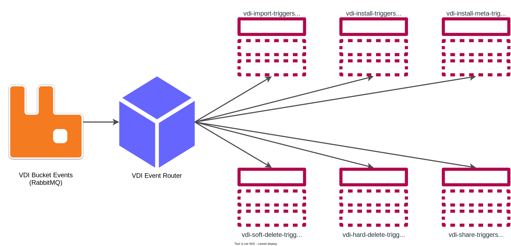

= VDI Event Router Module

The event-router module listens for bucket notification events coming from MinIO
through RabbitMQ, then translates and routes those messages to the appropriate
Kafka topic in the stack-internal Kafka instance.