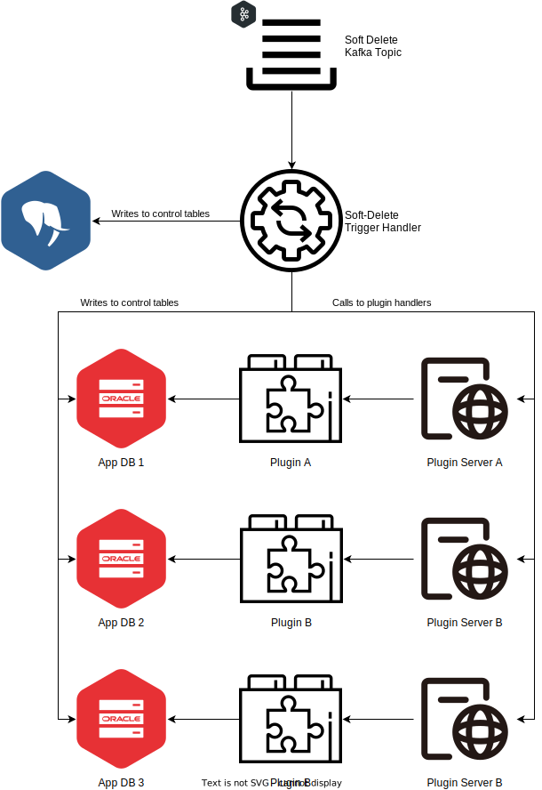

= VDI Module: Import Trigger Handler

This VDI module consumes soft-delete trigger messages from Kafka and performs
dataset uninstallation operations by updating the "deleted" flag in the internal
cache DB, updating the "deleted" flag in the target application database control
tables, and calling the appropriate plugin handler for the dataset's type for
each target project.

ifdef::env-github[]
++++

  

++++
endif::[]
ifndef::env-github[]

endif::[]

. A soft-delete flag object is created in MinIO (S3)
. MinIO emits an event to RabbitMQ for the object creation
. The VDI event router receives the event from RabbitMQ and routes it to the
  soft-delete trigger topic in Kafka
. The VDI soft-delete handler picks up the trigger from Kafka and...
.. Marks the dataset as deleted in the Cache DB
.. Calls the plugin handlers for all relevant projects to uninstall the dataset
   from each project.
.. Marks the dataset as deleted in the App DBs for the dataset's target
   projects.