= VDI Plugin Handler Server
:toc: left
:toclevels: 3
:icons: font

ifdef::env-github[]
:tip-caption: :bulb:
:note-caption: :information_source:
:important-caption: :heavy_exclamation_mark:
:caution-caption: :fire:
:warning-caption: :warning:
endif::[]

The VDI Plugin Handler Server is an HTTP server internal to the VDI Service
stack that accepts requests from the primary VDI service and calls out to the
appropriate VDI <<Plugin Scripts>> to handle those requests.

.Helpful Links
--
* https://github.com/VEuPathDB/vdi-plugin-examples[VDI Plugin Examples]
* https://veupathdb.github.io/vdi-plugin-handler-server/http-api.html[HTTP API Documentation]
--

== Usage

This repository defines a project that is not intended to be used or executed
directly.  Instead, the output artifact of this repository is a Docker image
that is to be extended to add the implementation <<Plugin Scripts>>.  An example
of this setup is provided and may be copied from the repo
link:https://github.com/VEuPathDB/vdi-plugin-examples[VDI Plugin Examples].

=== Configuration

Configuration of the server is done via the environment with a series of
required and optional environment variables.

==== Static Environment Variables

[%header,cols="1,5m,5m"]
|===
| Required | Variable | Default

3+<h| HTTP Server Settings

|
| SERVER_PORT
| 80

|
| SERVER_HOST
| 0.0.0.0

3+<h| Service Settings

| ✔
| LDAP_SERVER
|

| ✔
| ORACLE_BASE_DN
|

3+<h| Plugin Script Settings

|
| IMPORT_SCRIPT_PATH
| /opt/veupathdb/import

|
| IMPORT_SCRIPT_MAX_DURATION
| 1h

|
| INSTALL_DATA_SCRIPT_PATH
| /opt/veupathdb/install-data

|
| INSTALL_DATA_SCRIPT_MAX_DURATION
| 1h

|
| INSTALL_META_SCRIPT_PATH
| /opt/veupathdb/install-meta

|
| INSTALL_META_SCRIPT_MAX_DURATION
| 1h

|
| UNINSTALL_SCRIPT_PATH
| /opt/veupathdb/uninstall

|
| UNINSTALL_SCRIPT_MAX_DURATION
| 1h

|
| CHECK_COMPAT_SCRIPT_PATH
| /opt/veupathdb/bin/check-compatibility

|
| CHECK_COMPAT_SCRIPT_MAX_DURATION
| 1h
|===

`SERVER_PORT`:: Port the HTTP service will listen on for incoming connections.

`SERVER_HOST`:: Host IP the server will bind to on start up.

`LDAP_SERVER`:: Comma separated list of LDAP servers the service will use when
resolving LDAP records for specific database details.
+
The service will attempt to use the LDAP servers in order and will only proceed
to try the next server in the comma separated list if it fails to connect to the
previous server item.
+
.Example
[source]
----
LDAP_SERVER=my.ldap.server:389,my.other.server:389
----

`ORACLE_BASE_DN`:: Base portion of the distinguished name LDAP search.

`IMPORT_SCRIPT_PATH`:: Path to the <<Import Script>>.

`IMPORT_SCRIPT_MAX_DURATION`:: Maximum duration that the <<Import Script>> is
allowed to run before being forcibly killed.

`INSTALL_DATA_SCRIPT_PATH`:: Path to the <<Install-Data Script>>.

`INSTALL_DATA_SCRIPT_MAX_DURATION`:: Maximum duration that the
<<Install-Data Script>> is allowed to run before being forcibly killed.

`INSTALL_META_SCRIPT_PATH`:: Path to the <<Install-Meta Script>>.

`INSTALL_META_SCRIPT_MAX_DURATION`:: Maximum duration that the
<<Install-Meta Script>> is allowed to run before being forcibly killed.

`UNINSTALL_SCRIPT_PATH`:: Path to the <<Uninstall Script>>

`UNINSTALL_SCRIPT_MAX_DURATION`:: Maximum duration that the <<Uninstall Script>>
is allowed to run before being forcibly killed.

==== Database Connection Environment Variables

While the handler service itself does not connect to any databases, the scripts
that it calls may.  For these cases, the handler service will pass the database
connection details for the target database to the handler script via the call
time environment of that script.

Additionally, these database connections are variable, thus the environment
variables are not a static set of vars, but instead a static prefix with
wildcard matching on the suffix.  Environment variables with the same suffix
will be grouped together as a single bundle of vars.

.Wildcard Environment Variable Prefixes
[%header,cols="2m,6"]
|===
| Variable Prefix | Description

| DB_CONNECTION_NAME_*
| Name of the connection for the group of environment variables.

| DB_CONNECTION_LDAP_*
| LDAP query string for the connection.

| DB_CONNECTION_USER_*
| Database connection username.

| DB_CONNECTION_PASS_*
| Database connection password.
|===

.Environment Bundles
====
[source, bash]
----
DB_CONNECTION_NAME_PLASMO_DB=PlasmoDB
DB_CONNECTION_LDAP_PLASMO_DB=someLDAPQuery
DB_CONNECTION_USER_PLASMO_DB=someUsername
DB_CONNECTION_PASS_PLASMO_DB=somePassword
DB_CONNECTION_DATA_SCHEMA_PLASMO_DB=someSchema

DB_CONNECTION_NAME_TOXO_DB=ToxoDB
DB_CONNECTION_NAME_TOXO_DB=someLDAPQuery
DB_CONNECTION_USER_TOXO_DB=someUsername
DB_CONNECTION_PASS_TOXO_DB=somePassword
DB_CONNECTION_DATA_SCHEMA_TOXO_DB=someSchema
----
====

== Publishing Server Updates

Once a change has been made to the VDI plugin handler server and is on the main
branch, the following steps must be taken to get the change out to the
individual plugins.

. Git tag the new version of the plugin server.
. Wait for Jenkins to build and publish the new server version's docker image.
. Update the Dockerfile in the https://github.com/VEuPathDB/vdi-docker-plugin-base[vdi-docker-plugin-base]
  repository to pull from the new plugin server docker image version.
. Push the change and git tag the new plugin-base image.
. Wait for Jenkins to build and publish the new plugin-base docker image.
. Iterate through all the VDI plugin projects and update the Dockerfiles to pull
  from the new plugin-base docker image version.

== Plugin Scripts

{nbsp}

The VDI Plugin Handler Server wraps 4 plugin "scripts" that may be written in
any language, however must be callable via a CLI call aligning with the API as
defined below.

The plugin scripts are:

. The <<Import Script>>
. The <<Install-Meta Script>>
. The <<Check Compatibility Script>>
. The <<Install-Data Script>>
. The <<Uninstall Script>>

=== Import Script

The import script is the first phase of handling of an uploaded VDI dataset.
This script is responsible for performing the initial validation of the raw
input, and optionally transformation of that input into a form suitable for
installation into target VEuPathDB sites.

The import script will be handed a collection of submitted dataset files, and is
expected to perform its processing, producing one or more output files which
will be used as the final form of the data to be installed into the target
VEuPathDB sites.

==== Inputs

===== CLI

As inputs the import script will be passed two CLI positional arguments, an
input directory path and an output directory path.

.Structure
[source, shell-session]
----
$ import {path-to-inputs} {path-to-outputs}
----

* `{path-to-inputs}` <<import-inputs>>
* `{path-to-outputs}` <<import-outputs>>

.Example
[source, shell-session]
----
$ import /path/to/inputs /path/to/outputs
----

===== Environment

[%header, cols="2m,8"]
|===
| Variable      | Description
| VDI_ID        | ID assigned by VDI to the dataset being processed.
| VDI_IMPORT_ID | Generated DB identifier safe ID for the import.
|===

===== Workspace

[#import-inputs]
==== Inputs

The input directory path will point to a temp directory that is populated with
the raw input files in addition to the dataset's metadata in a file named
`vdi-meta.json`.  After the import script has exited, the input directory will
be deleted.

[TIP]
--
The Import Script will never be called with an empty input directory.  If an
uploaded archive contains no files, the VDI Plugin Handler Server will return
an error response without calling the Import Script.
--

[#import-outputs]
==== Outputs

As output, the script will be expected to write "installable" files to the
output directory handed to the import script on execution.

After the script execution has been completed, the files the import script
places in the output directory will be consumed by the VDI Plugin Handler Server
and will become the VDI dataset bundle that is installed into the target
VEuPathDB sites.

[IMPORTANT]
--
On successful completion (exit code `0`) the Import Script _must_ produce at
least one installable output file.  If the Import Script does not produce any
output files, the VDI Plugin Handler Server will return a `500` error for the
execution of the import.
--

===== Reserved File Names

The import script may produce any files it needs, provided they are not named
with one of the following reserved file names.

`vdi-meta.json`:: This file name is reserved for the dataset's metadata file
which is produced by the VDI Plugin Handler Server itself after the import
script has completed execution.
+
If the import script _does_ produce a file named `vdi-meta.json`, the handler
server will throw an exception.

`vdi-manifest.json`:: This file name is reserved for the dataset's manifest file
which is produced by the VDI Plugin Handler Server itself after the import
script has completed execution.
+
If the import script _does_ produce a file named `vdi-manifest.json`, the
handler server will throw an exception.

`warnings.json`:: This file name is reserved for the dataset's validation
warning messages file which is produced by the VDI Plugin Handler Server itself
after the import script has completed execution.
+
If the import script _does_ produce a file named `warnings.json`, the handler
server will throw an exception.

==== Working Directory

The import script will not only be handed an input and output directory from and
to which its inputs and outputs are to be delivered, it is also called in the
context of a temporary `CWD` (current working directory).  This means that the
script may create files and directories relative to its `CWD` freely as the
`CWD` itself will be recursively deleted on completion of the script.

==== Logging

The import script is expected to log messages to 2 separate channels with
specific meaning assigned to each, `STDOUT` and `STDERR`.

`STDOUT` is used solely to emit validation warnings and errors.
All messages written to this channel will be surfaced to the submitter of the
VDI dataset being processed (e.g. an end user).

`STDERR` is used to emit general script log output.  All messages
written to this channel will be passed through to the standard logging of the
VDI Plugin Handler Server, for developer/operations use.

==== Exit Codes

The import script is expected to conform to the following specification of
process exit codes.  Each exit code has an assigned meaning and is used to
determine how the VDI Plugin Handler Server process should proceed after the
script exits.

.Exit Codes
[source]
----
0   - Successful exit
1   - Failure due to validation errors
2+  - Failure due to unexpected/undefined error
----

=== Install-Meta Script

TODO: Describe me!

==== Inputs

===== CLI

The Install-Meta Script will be passed two positional CLI arguments on
execution, the ID of the dataset, and the path to a
<<Dataset Metadata,metadata JSON>> file.

.Structure
[source, shell-session]
----
$ install-meta {vdi-id} {path-to-meta-json}
----

.Example
[source, shell-session]
----
$ install-meta d002dcac1aff37435c355f8deb16ee17 /some/path/to/vdi-meta.json
----

The `vdi-meta.json` file will exist for the duration of the script's execution.

===== Environment

[%header, cols="2m,8"]
|===
| Variable    | Description
| DB_HOST     | Database connection hostname.
| DB_PORT     | Database connection port.
| DB_NAME     | Target database name.
| DB_USER     | Database credentials username.
| DB_PASS     | Database credentials password.
| DB_SCHEMA   | Database schema for user dataset data to be installed to.
| DB_PLATFORM | Database platform type (`Oracle\|Postgres`)
| PROJECT_ID  | Project ID for the target project the dataset should be installed into.
| DATA_FILES  | Path to the directory into which the dataset files should be installed.
| VDI_ID      | ID assigned by VDI to the dataset being processed.
|===

[IMPORTANT]
--
The `DB_PLATFORM` environment variable value will always be lowercased, for Perl
scripts using DBD the environment variable value will need to have its first
letter uppercased to read "Oracle" rather than "oracle".
--

==== Outputs

This script is not expected to produce any outputs.

==== Working Directory

The install-meta script will be called in the context of a temporary `CWD`
(current working directory).  This means that the script may create files and
directories relative to its `CWD` freely as the `CWD` itself will be recursively
deleted on completion of the script.

==== Logging

This script is expected to log only to `STDERR`, messages logged to `STDOUT`
will be disregarded.

Messages logged to `STDERR` will be recorded in the logs of the VDI Plugin
Handler Server itself.

==== Exit Codes

[source]
----
0    - Success
1+   - Failure due to unxpected/undefined error.
----
=== Check Compatibility Script

==== Inputs

===== CLI

The script will not be passed any arguments on the CLI call.

.Example
[source, shell-session]
----
$ check-compatibility
----

===== `STDIN`

The script will be piped a collection of dependency identifiers and versions as
a stream on `STDIN` of pairs.  The identifier and version will be separated by
a single tab character, and the pairs will be separated by newlines.

.Example Input
[source]
----
identifier1	version1
identifier2	version2
identifier3	version3
----

.Test Call
[source, shell-session]
----
$ check-compatibility <<EOF
identifier1	version1
identifier2	version2
identifier3	version3
EOF
----

===== Environment

[%header, cols="2m,8"]
|===
| Variable    | Description
| DB_HOST     | Database connection hostname.
| DB_PORT     | Database connection port.
| DB_NAME     | Target database name.
| DB_USER     | Database credentials username.
| DB_PASS     | Database credentials password.
| DB_SCHEMA   | Database schema for user dataset data to be installed to.
| DB_PLATFORM | Database platform type (`Oracle\|Postgres`)
| PROJECT_ID  | Project ID for the target project the dataset should be installed into.
| VDI_ID      | ID assigned by VDI to the dataset being processed.
|===

==== Outputs

This script is not expected to produce any outputs.

==== Logging

The check-compatibility script is expected to log only to `STDERR`, messages
logged to `STDOUT` will be disregarded.

Messages logged to `STDERR` will be recorded in the logs of the VDI Plugin
Handler Server itself.

==== Exit Codes

[source]
----
0    - Required dependencies are met (compatible).
1    - Requried dependencies are not met (incompatible).
1+   - Failure due to unexpected/undefined error.
----

=== Install-Data Script

TODO: Describe me!

==== Inputs

===== CLI

The Install-Data Script will be passed two positional CLI arguments on
execution, the ID of the dataset to be installed, and a path to a temporary
directory containing the contents of the dataset to be installed.

.Structure
[source, shell-session]
----
$ install-data {vdi-id} {path-to-dataset-files}
----

.Example
[source, shell-session]
----
$ install-data bfcb312a5875ae38536a64e60055c74e /path/to/dataset/files
----

The input directory is temporary and will be removed as soon as the script
completes its execution.

===== Environment

[%header, cols="2m,8"]
|===
| Variable    | Description
| DB_HOST     | Database connection hostname.
| DB_PORT     | Database connection port.
| DB_NAME     | Target database name.
| DB_USER     | Database credentials username.
| DB_PASS     | Database credentials password.
| DB_SCHEMA   | Database schema for user dataset data to be installed to.
| DB_PLATFORM | Database platform type (`Oracle\|Postgres`)
| PROJECT_ID  | Project ID for the target project the dataset should be installed into.
| DATA_FILES  | Path to the directory into which the dataset files should be installed.
| VDI_ID      | ID assigned by VDI to the dataset being processed.
|===

==== Outputs

This script is not expected to produce any outputs.

==== Working Directory

The install-meta script will be called in the context of a temporary `CWD`
(current working directory).  This means that the script may create files and
directories relative to its `CWD` freely as the `CWD` itself will be recursively
deleted on completion of the script.

==== Logging

The Install-Data script is expected to log messages to 2 separate channels with
specific meaning assigned to each, `STDOUT` and `STDERR`.

`STDOUT` is expected to be used solely to emit installation warnings and errors.
All messages written to this channel will be surfaced to the submitter of the
VDI dataset being processed.

`STDERR` is expected to be used to emit general script log output.  All messages
written to this channel will be passed through to the standard logging of the
VDI Plugin Handler Server.

==== Exit Codes

[source]
----
0    - Success
1    - Failure due to validation error.
2+   - Failure due to unxpected/undefined error.
----

=== Uninstall Script

TODO: Describe me!

==== Inputs

===== CLI

The Uninstall Script will be passed a single positional CLI argument on
execution, the VDI dataset ID of the dataset to be uninstalled.

.Structure
[source, shell-session]
----
$ uninstall {vdi-id}
----

.Example
[source, shell-session]
----
$ uninstall bfcb312a5875ae38536a64e60055c74e
----

===== Environment

[%header, cols="2m,8"]
|===
| Variable    | Description
| DB_HOST     | Database connection hostname.
| DB_PORT     | Database connection port.
| DB_NAME     | Target database name.
| DB_USER     | Database credentials username.
| DB_PASS     | Database credentials password.
| DB_SCHEMA   | Database schema for user dataset data to be installed to.
| DB_PLATFORM | Database platform type (`Oracle\|Postgres`)
| DATA_FILES  | Path to the directory from which the dataset files should be uninstalled.
| VDI_ID      | ID assigned by VDI to the dataset being processed.
|===

==== Outputs

This script is not expected to produce any outputs.

==== Working Directory

The install-meta script will be called in the context of a temporary `CWD`
(current working directory).  This means that the script may create files and
directories relative to its `CWD` freely as the `CWD` itself will be recursively
deleted on completion of the script.

==== Logging

This script is expected to log only to `STDERR`, messages logged to `STDOUT`
will be disregarded.

Messages logged to `STDERR` will be recorded in the logs of the VDI Plugin
Handler Server itself.
==== Exit Codes

[source]
----
0    - Success
1+   - Failure due to unxpected/undefined error.
----

== HTTP API

link:https://veupathdb.github.io/vdi-plugin-handler-server/http-api.html[API Documentation]

TODO

