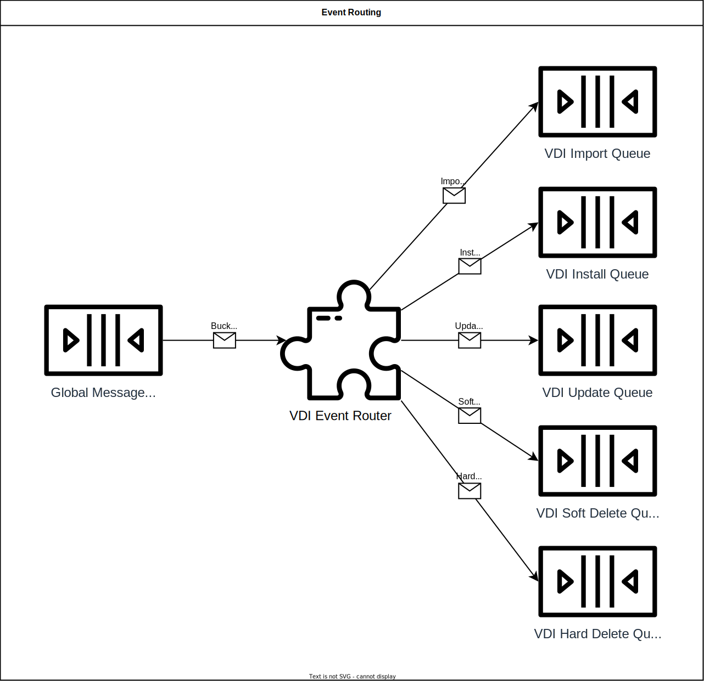

= VEuPathDB Dataset Installer Service (VDI)
:source-highlighter: highlightjs
:toc: preamble

* link:https://veupathdb.github.io/vdi-service/vdi-api.html[VDI Service API Doc]
* link:https://veupathdb.github.io/vdi-service/design/1.0/design.html[VDI Service Design Doc]

== Project Structure

=== Modules

* Event Router
* Import Handler
* Installation Handler
* REST Service

=== Components

== Workflow

=== User Actions

==== Create VD

image::docs/design/1.0/assets/3-vd-upload.svg[]

==== Delete VD

=== Internal Actions

==== Event Routing

== Queues

Bucket Events:: Events coming from MinIO for operations on objects in the VDI
bucket.

Import Triggers:: Events that each indicate a dataset has been uploaded and is
ready to be imported.
+
[source, protobuf]
----
message ImportTrigger {
  required string vdid = 1;
}
----

Import Results:: Events containing the result of an import attempt.
+
[source, protobuf]
----
enum ImportStatus {
  SUCCESS = 0;
  FAILURE = 1;
}

message ImportResult {
  required string vdid = 1;
  required ImportStatus status = 2;
}
----

Install Triggers:: Events that each indicate a dataset has been imported and is
ready to be installed.
+
[source, protobuf]
----
message InstallTrigger {
  required string vdid = 1;
}
----

Install Results:: Events containing the result of a dataset install attempt.
+
[source, protobuf]
----
enum InstallStatus {
  SUCCESS = 0;
  FAILURE = 1;
}

message InstallResult {
  required string vdid = 1;
  required string projectId = 2;
  required InstallStatus status = 3;
}
----

Update Triggers:: Events that each indicate a dataset's metadata has been
updated by the user and the update needs to be installed.
+
[source, protobuf]
----
message UpdateTrigger {
  required string vdid = 1;
}
----

Update Results:: Events containing the result of a dataset metadata install
attempt.
+
[source, protobuf]
----
enum UpdateStatus {
  SUCCESS = 0;
  FAILURE = 1;
}

message UpdateResult {
  required string vdid = 1;
  required string projectId = 2;
  required UpdateStatus status = 3;
}
----

* Soft Delete Triggers
* Soft Delete Results

* Hard Delete Triggers
* Hard Delete Results